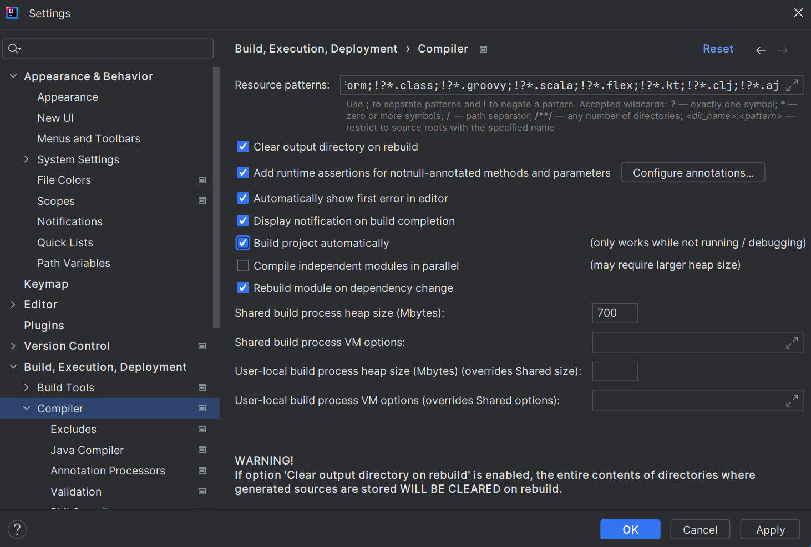
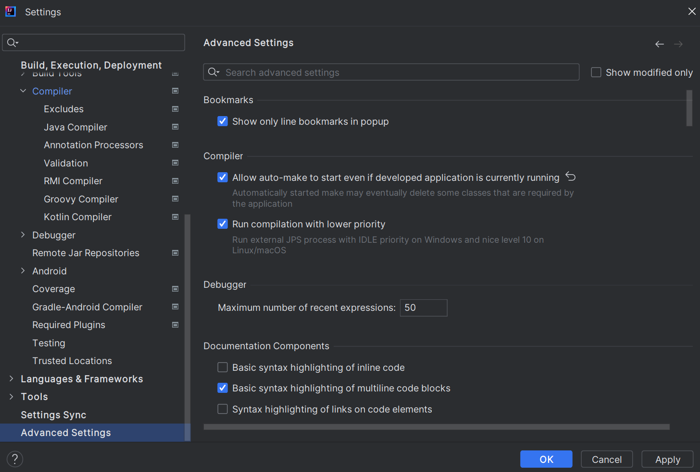
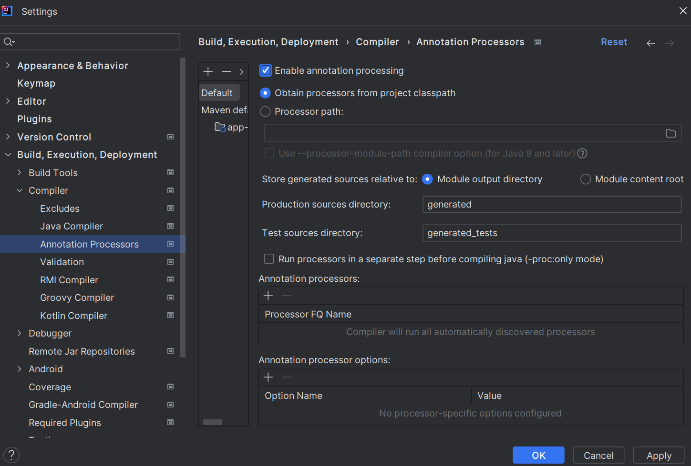

# Configurar proyecto en IntelliJ IDEA

## Pasos:

1. Ir a **"File / Settings / Builds, Execution, Deployment / Compiler"**

2. Activar la casilla **"Build project autotically"**

	

3. Ir a **"File / Settings / Advanced Settings"**

4. En la sección **"Compiler"**, activar la opción **"Allow auto-make to start even if developed application is currently running"**

	

5.	Hacer clic en el botón **"Apply"** y luego en el **"Ok"** para confirmar los cambios. 

6. Crear la Base de datos

7. Crear la configuración de la Base de Datos.  Abrir el archivo **"aplication.properties"** que se encuentra en la carpeta **"resources"** del proyecto y copiar lo siguiente:

	```
	spring.datasource.url=jdbc:mysql://localhost:3306/apirest?useSSL=false&serverTimezone=UTC
	spring.datasource.username=root
	spring.datasource.password=Marlon12345*

	spring.datasource.driver-class-name=com.mysql.cj.jdbc.Driver
	spring.jpa.database-platform=org.hibernate.dialect.MySQLDialect

	spring.jpa.show-sql=true
	spring.jpa.hibernate.ddl-auto=update
	logging.level.org.hibernate.SQL=debug

	server.port=8081
	```

8. Ir a **"File / Settings / Builds, Execution, Deployment / Compiler / Annotation Processor"** y activar la casilla **"Enable annotation processing"**

	


